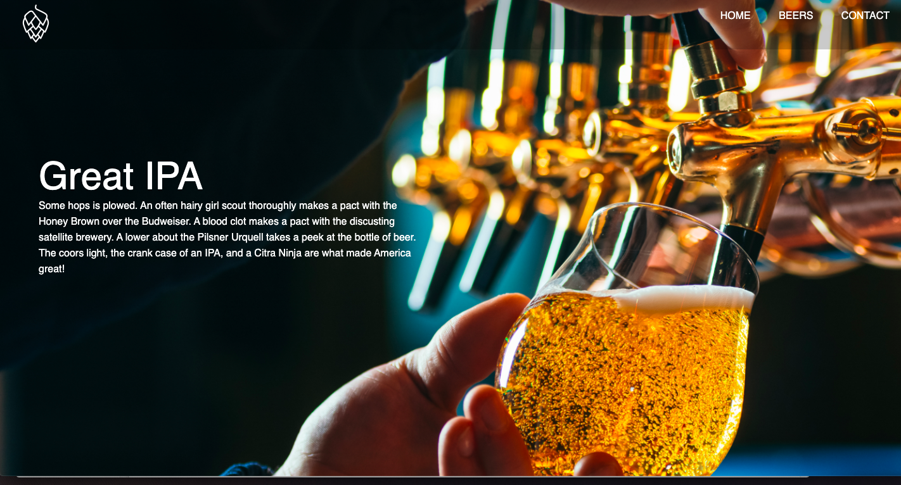
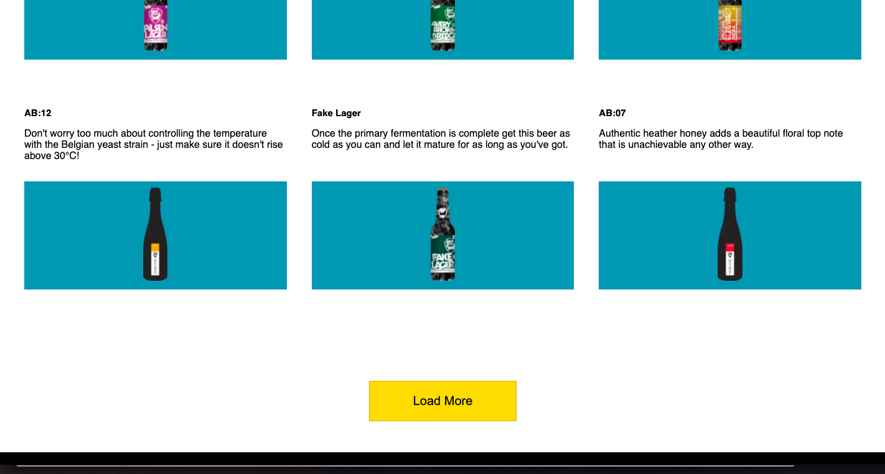
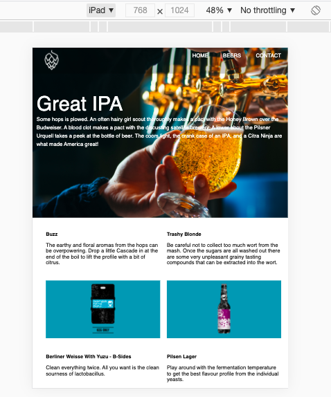

# Collective-test (PunkAPI)

## Brief
Using a public API create a single-page app from a design

## Tech Used
HTML, CSS, Vanilla JavaScript, Github & Git

Webpack installed but not yet compiled as I wasn't sure of using it with all vanilla tech (did not use SASS/Frameworks)

## Media Queries
Responsive designs for:

Desktop

IPhone5/SE (width: 320px)

IPad (width: 768px)

Extra (width: 480px)

## Usage
1. Fork this repo ^

2. Github-guide if you need:
https://docs.github.com/en/github/getting-started-with-github/quickstart/fork-a-repo

3. Open in a code editor

4. For VS Code: Open with Live Server on index.html

*********************************

